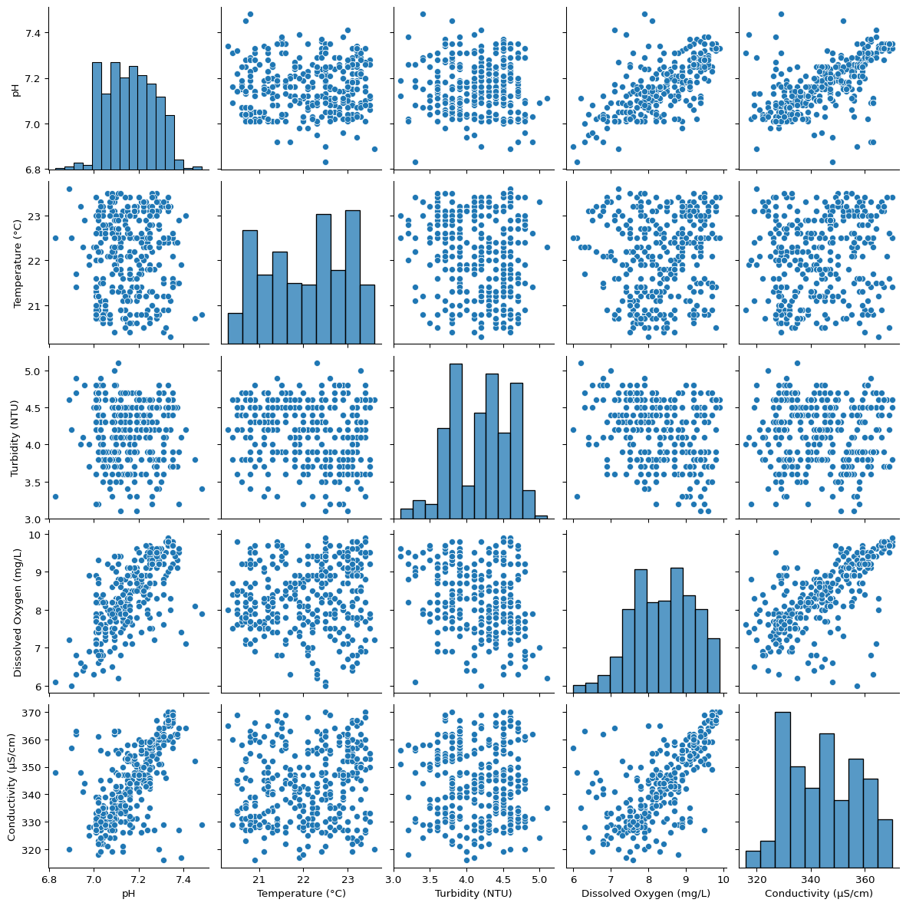
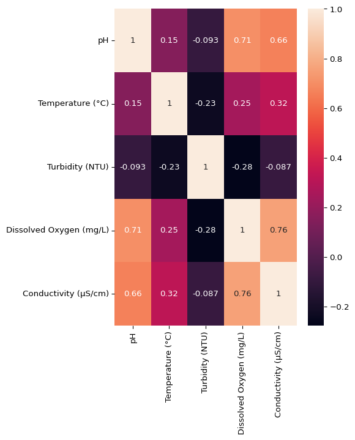

# Water Quality Assessment

- [Description](#description)
- [Methods](#methods)
- [Results](#results)

## Description

This project is an analysis of water quality tests using data from a
[Kaggle
dataset](https://www.kaggle.com/datasets/shreyanshverma27/water-quality-testing).

The dataset provides 200 rows of water quality testing instances
contemplating the following variables:

- pH
- Temperature (°C)
- Turbidity (NTU)
- Dissolved Oxygen (mg/L)
- Conductivity (µS/cm)

The aim of this project is to assess the data provided through an
Exploratory Data Analysis to evaluate the physical and chemical
parameters of the water in accordance with the [Brazilian legislation
regarding water
potability](https://bvsms.saude.gov.br/bvs/saudelegis/gm/2021/prt0888_07_05_2021.html)
(original portuguese text).

## Methods

The `eda.ipynb` and `testing.ipynb` file are the notebooks for the EDA
and for the testing of the module developed for the modelling
respectively. The `data/` folder includes the `.csv` and `src/` contains
the functions for preprocessing and modelling of a Random Forest
Regressor.

## Results

The structure of the data can be viewed here:

| pH       | Temperature (°C) | Turbidity (NTU) | Dissolved Oxygen (mg/L) | Conductivity (µS/cm) |
|----------|------------------|-----------------|-------------------------|----------------------|
| 7.250000 | 23.100000        | 4.500000        | 7.800000                | 342                  |
| 7.110000 | 22.300000        | 5.100000        | 6.200000                | 335                  |
| 7.030000 | 21.500000        | 3.900000        | 8.300000                | 356                  |
| 7.380000 | 22.900000        | 3.200000        | 9.500000                | 327                  |
| 7.450000 | 20.700000        | 3.800000        | 8.100000                | 352                  |

A pairplot and a heatmap are useful in demonstrating the distribuition
of data and the linear correlations betwen the variables:

The performance of the model is displayed in code:

    [RandomForestRegressor(n_estimators=1000, random_state=42),
     {'r2': 0.7120092074666291,
      'mae': 0.26272562626261914,
      'rmse': 0.45081460320675126}]
